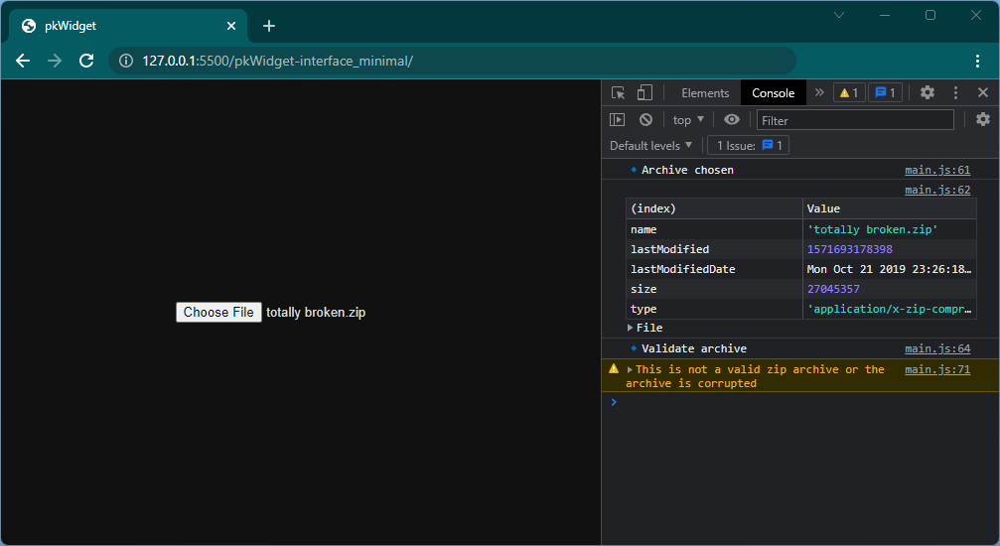

# Minimal interface version

This is the version of the widget with minimal interface. You can create whatever you want basing on it.

### Functionality
* Validates files
* Detects the platform
* Sends files to PatchKit and process them
* Shows progress
* Allows to download the PatchKit Launcher with the uploaded game

## Dependencies
* [zip.js](https://gildas-lormeau.github.io/zip.js/)

## Run the widget

> [!ATTENTION]
> Run the server first!

Open the `pkWidget-interface_minimal` folder on the live server.

If you are using VSCode with Live Server extension, just open the folder in VSCode and click the `Go Live` icon in the bottom-right corner.

The widget should open in the web browser.

## Analyzing how it works

Each widget's operation is logged in the web browser console. The most common shortcut to access the console is `F12`. If you have any issues, check out [this article](https://balsamiq.com/support/faqs/browserconsole/).

You can find the lines of code that make the logs in the `src/main.js` and easily analyze what happens in every step.


## File structure

* lib
  * `zip.min.js` - minimized zip.js library
* src
  * `config.js` - configuration
  * `main.js` - here is the main operation flow
  * `request.js` - wrapper for requests making code in main.js clearer
  * `utils.js` - collection of utils making code in main.js clearer

## The general way the widget works

In the `index.html` there is a div with the 'widget' id. This is the main container where widget will appear.
The interface is as minimalist as it gets. For this there is no separate .css file. The **styles** are also set in the `index.html` file.

At the bottom of the `main.js` file is the line:
``` js
showFileInput(onFileChange);
```
It renders the file input element inside the 'widget' div and adds a callback when the file will change. This is the main screen you can see after running the widget.

### Flow

Launcher performs a certain sequence of operations that save their results in a global object named `widgetData`.
In general, each step needs data from the previous step and gets it from there.


### onFileChange
This function calls after the file has changed. It saves the file into `widgetData.archive` and starts its **validation**. If the **validation** is OK, it **request upload** - otherwise an error is displayed. 

In return from the **upload request** we get the `uploadId` and `jwt` which are also saved in the `widgetData`.

The next step is to detect the game platform. The program analyzes each entry in the archive and selects potential exe files. Then detects the platform of each exe.

> [!NOTE]
> PatchKit currently has its own exe detection and you can't pass the exe path manually. That is why we don't recommend to change the `exeSearchDepth` in the config file. Exe file must be in the main directory of the game or PatchKit will struggle to detect it. **(This may change in the future)**

The detected platforms are shown as buttons. You can choose the right one and go further.

### onPlatformSelect
This function calls after the platform has been chosen. First the platform is saved in the `widgetData`.

Then the `uploadId`, `archive` and `jwt` is sent to the utils for furter requests using `setUploadData` function.
Progress showing up and **chunk upload** starts. If everything goes fine, we go further otherwise in the console should be an error.

> [!NOTE]
> You can change the chunk size in config, but max chunk size is 10MB. Chunks help if there was an upload problem. If the upload breaks in some way, it should continue from the previous chunk, not from the beginning.

### onFileUploaded
If files are uploaded the **creating app request** is sent on the account connected with the widget by API key.
`appSecret` and `versionId` is saved into the `widgetData` object.
Then processing starts. To the `widgetData` `jobId` is saved. It allows to track the processing.

If processing passed, publishing starts.

At the end button with URL to download the launcher is displayed.