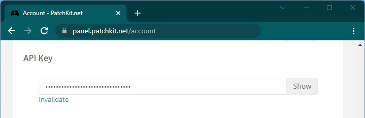

# Server

> [!ATTENTION]
> Edit config file and set the API key before starting the server for the first time!

> [!NOTE]
> The server is only a localhost example. In production environment you will need to do your own implementation and set the endpoint to your server in the interface config.

## Dependencies
* axios v0.26.1
* cors v2.8.5
* express v4.17.3

## Config

Open the `pkWidget-server/config.js` in a text editor and set the `api_key` to your PatchKit account API.

You can find the API key on the `Account` page on the panel.

> [!WARNING]
> Remember that API key must be private and protected. This is why it is stored on an external server and not on the frontend!

## Run the server

To start the server, open `pkWidget-server/index.js` in the `node` terminal.

On Windows you can just click the `server_start.bat`.

> [!TIP]
> If the `node` command is not available from the terminal, add the `node` folder to the system path.

